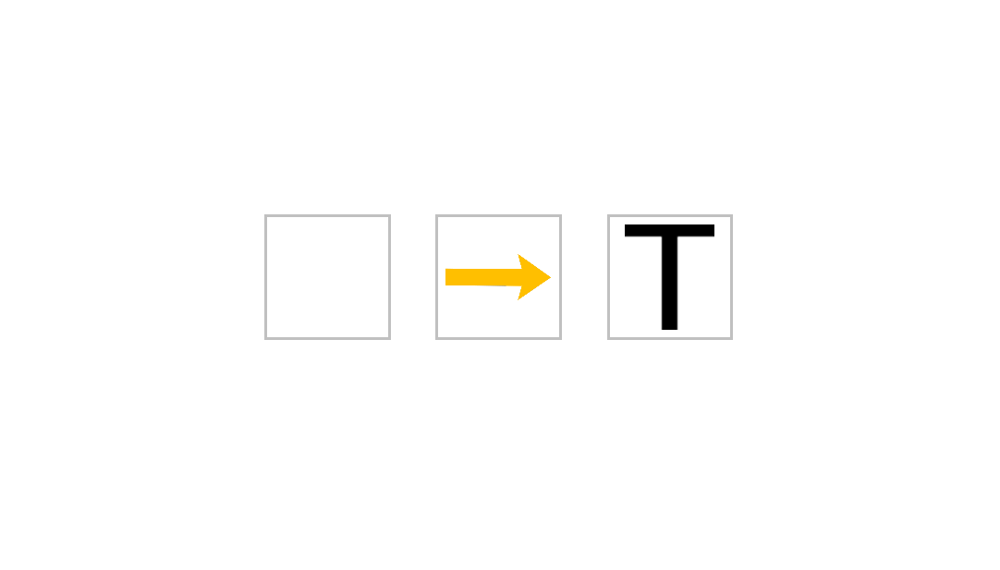

# the-shapening 3

Code to the third experiment of my diploma thesis.

----------------------------------------------------------------------------
## WHAT DOES THIS THING DO ?

Basically the code executes a endogenous [Posner cueing task](https://en.wikipedia.org/wiki/Posner_cueing_task). 
  
Flow chart


 
This is a valid cue
 

 
This is a invalid cue
 

 
 ----------------------------------------------------------------------------
 
Screenshot of the cue and stimulus
 

 
----------------------------------------------------------------------------
## REQUIREMENTS & INSTALLATION

* Linux, i used [Lubuntu 14.04.2](http://lubuntu.net/)
* [GNU Octave](https://www.gnu.org/software/octave/), I used version 3.8.2
* [Psychtoolbox-3]( https://psychtoolbox-3.github.io/overview/) for easy install use [neurodebian](http://neuro.debian.net/)
* [awesomeStuff] (https://github.com/wuschLOR/awesomeStuff/) 
* [R] (http://cran.r-project.org/) ,I used version 3.1.2

### ubuntu

assuming you have your Linux with Octave and Psychtoolbox up and running:

1. navigate to your folder where you want to put stuff
2. clone awesomestuff and the-shapening2

```
  git clone https://github.com/wuschLOR/the-shapening3.git
  git clone https://github.com/wuschLOR/awesomeStuff.git
```

3. navigate to the awesomestuff folder start octave

```
  cd /awesomeStuff
  octave
```

4. add the awesomestuff to your Octave paths

```
  pathAdd
  exit
```

5. now lets start it up start octave again

```
  cd ..
  cd /the-shapening3
  octave
```

6. run the experiment

```
  goshapes3
```

7. PROFIT !!!

----------------------------------------------------------------------------
## LICENSE and COPPYRIGHT

* Most of this stuff was written by Michael Groh.
* If we meet some day, and you think this stuff is worth it, you can buy me a beer in return.
* If you use this for awesome science feel free to cite my (hopefully finished) diploma thesis or the resulting paper (also hopefully). 
* The Code is licensed under [GPL v.3](./LICENSE) unless marked otherwise. 
* The Images are licensed under ???no idea just ask me for now.

----------------------------------------------------------------------------
## Biblatex

```
@software{groh_shapening_2015,
        title = {the shapening 3},
        rights = {{GPL}3},
        url = {https://github.com/wuschLOR/the-shapening3},
        author = {Groh, Michael},
        date = {2015}
}
```

----------------------------------------------------------------------------
